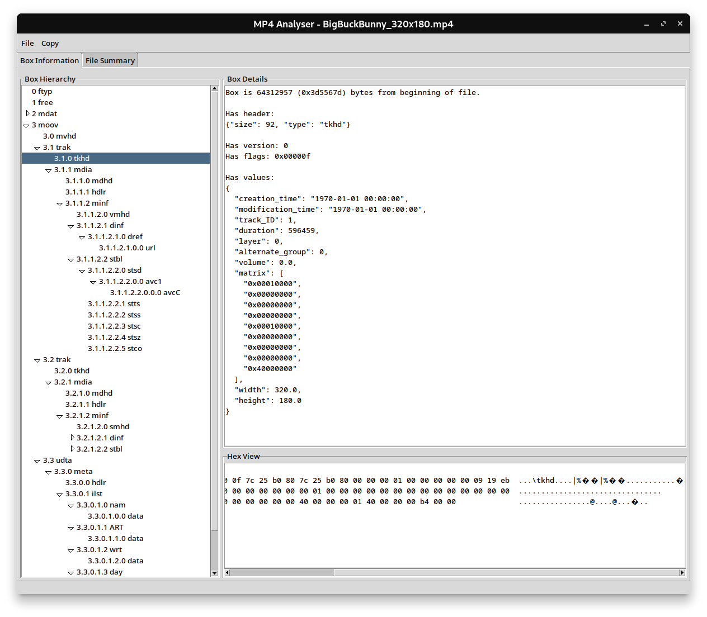
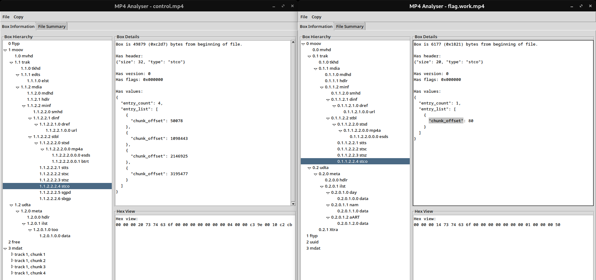

One day while browsing CTFs on [ctflearn](https://ctflearn.com) I stumbled upon a rather unique challenge. Instead of debugging or reverse engineering the code, it was an `.mp4` file that somehow got *mixed up*. Since I like both video compression and reverse engineering I immediately picked up on this challenge.

```
My MP4 file has identity issues, he thinks he is something else! I'm sure he is just mixed up, but really, who knows?
We might be both right, We might be both wrong.
```

This was the provided description, and the `.mp4` file was also attached.

## What we're dealing with

First thing I did was to check the downloaded file:
```shell
$ ls -la flag.mp4 
-rw-r--r-- 1 user user 408083 Aug 15 22:27 flag.mp4
```
```
$ file flag.mp4
flag.mp4: Apple QuickTime movie (fast start)
```
```
$ strings flag.mp4
...
dk40L
l@wP
DELETETHIS MESSAGE, IT IS NOT A PART OF THE PROBLEM, IF YOU LIKE THE PROBLEM PLEASE LEAVE A LIKE ON THE CTFLEARN WEBSITE!
```

Running `strings` we can see, there's a message concatenated at the end. At first I thought that would be it but boy I was wrong...
After trying to understand what the message is actually about, I decided to remove it from the end of `.mp4` file just like it told me to. Not sure what was its purpose but maybe just to reassure people that the challenge is solvable.

Next I tried to decode the file with `ffmpeg` and `mpv`:

```shell
$ ffmpeg -hide_banner -i flag.mp4
[aac @ 0x5c908b021d00] channel element 0.4 is not allocated
Input #0, mov,mp4,m4a,3gp,3g2,mj2, from 'flag.mp4':
  Metadata:
    creation_time   : 2019-12-25T17:18:32.000000Z
    date            : 2019
    title           : Recording (2)
    album_artist    : Voice Recorder
  Duration: 00:00:32.44, start: 0.000000, bitrate: 100 kb/s
  Stream #0:0[0x2](und): Audio: aac (LC) (mp4a / 0x6134706D), 44100 Hz, mono, fltp, 99 kb/s (default)
      Metadata:
        creation_time   : 2019-12-25T17:18:32.000000Z
        handler_name    : SoundHandler
        vendor_id       : [0][0][0][0]
At least one output file must be specified
```
```
$ mpv flag.mp4
 (+) Audio --aid=1 (*) (aac 1ch 44100Hz)
File tags:
 Album_Artist: Voice Recorder
 Date: 2019
 Title: Recording (2)
[ffmpeg/audio] aac: channel element 0.4 is not allocated
Error decoding audio.
[ffmpeg/audio] aac: channel element 0.0 is not allocated
Error decoding audio.
[ffmpeg/audio] aac: Reserved bit set.
[ffmpeg/audio] aac: channel element 0.0 is not allocated
Error decoding audio.
[ffmpeg/audio] aac: channel element 1.0 is not allocated
Error decoding audio.
[ffmpeg/audio] aac: Number of bands (8) exceeds limit (2).
...
```

Now we know something is indeed wrong with our input file. The errors are from the `aac` decoder itself so it looks like the bitstream is corrupted. Now we have to go deeper.

## MP4 container structure

Before we continue, we must know the structure of `.mp4` file down to raw bytes. To play a multimedia file, the decoder must know the parameters like resolution, framerate, length amd other important metadata. Bitstreams of popular multimedia codecs like H.264, AV1 often do not contain these parameters. Also if we want to play more than one codec at once, multimedia containers like `.mp4` are the only option. They provide accurate timestamps so the player can synchronize for example audio sampled 44100 times a second, a video at 23.976 fps and subtitles.

In MP4 container the data is contained in `atoms`. Think of them as boxes for any kind of data ranging from headers to large video bitstream chunks. In MP4 container, everything is an atom even the magic number, the header and the encoded bitstream. For more context you can see a long list of atoms [here](https://cconcolato.github.io/mp4ra/atoms.html).

Some atoms are more important than others. Every `.mp4` file has to contain these:

- `ftyp` - A header indicating which version of the standard does the file use
- `moov` - Atom containing data required for video playback like packets, timestamps and streams metadata
- `mdat` - An atom containing the actual data of encoded bitstreams (usually the largest one)

Here's how a sample `.mp4` file should look like:

```
00000000: 0000 0014 6674 7970 6973 6f6d 0000 0200  ....ftypisom....
00000010: 6d70 3431 0000 0008 6672 6565 03d5 55e5  mp41....free..U.
00000020: 6d64 6174 0000 00d1 6588 8200 1f5f fff8  mdat....e...._..
00000030: 228a 0002 2dbe 38c7 1939 3939 3939 3939  "...-.8..9999999
00000040: 3939 3939 3939 3939 3939 393a ebae baeb  99999999999:....
00000050: aeba ebae baeb aeba ebae baeb aeba ebae  ................
...
```

The first thing we see is the `ftypisom` word which represents an `ftyp` atom with `isom` brand. Also note the 4 bytes before every atom determine its length (big endian). In our case the length of `ftyp` atom is `0x14 == 20` bytes.
```
           atom code  version
               v         v
    0x00000014 ftyp isom 0x00000200 mp41
    ^               ^               ^
atom size         brand     compatible brands
```

The next atom is `free`. It is only used for padding purposes and its size can be 0.
```
    0x00000000 free
    ^          ^
atom size  atom code
```

After the padding there's an `mdat` header with the length of `0x03d555e5` which is around `64 megabytes`. This is the size of video data.

```
    0x03d555e5 mdat 0x000000d1...
    ^          ^    ^
atom size      |  video data...
          atom code
```

Now, where is `moov` atom? In `MP4 containers`, for some reason the default placement of media playback information is at the end of file so right after the bitstream data. I found `moov` atom just after `media data`. Here's a relevant part of sample file:

```
03d55600: 5c00 0540 826d 6f6f 7600 0000 6c6d 7668  \..@.moov...lmvh
03d55610: 6400 0000 007c 25b0 807c 25b0 8000 0003  d....|%..|%.....
03d55620: e800 0919 eb00 0100 0001 0000 0000 0000  ................
03d55630: 0000 0000 0000 0100 0000 0000 0000 0000  ................
03d55640: 0000 0000 0000 0100 0000 0000 0000 0000  ................
03d55650: 0000 0000 0040 0000 0000 0000 0000 0000  .....@..........
03d55660: 0000 0000 0000 0000 0000 0000 0000 0000  ................
03d55670: 0000 0000 0300 01d3 ff74 7261 6b00 0000  .........trak...
03d55680: 5c74 6b68 6400 0000 0f7c 25b0 807c 25b0  \tkhd....|%..|%.
```

You may notice there are also other atoms like `mvhd`, `trak` and `tkhd`. These are all in the data range of `moov` which is `0x00054082 == 344194` bytes in size. That's perfectly normal. There can be other atoms under their parents. This forms a tree-like structure and helps keep things more organized.

To view all atoms in this structure we can use [mp4analyser](https://github.com/essential61/mp4analyser).



I won't get into much detail but you can play around, the program is awesome and it helped me a lot when solving this challenge. Now we can go back to our troubled `.mp4` file.

## Fixing the MP4

The `flag.mp4` file looks like this:

```
00000000: 5245 444b 6d6f 6f76 0000 006c 6d76 6864  REDKmoov...lmvhd
00000010: 0000 0000 da29 4a68 da29 4a68 0000 ac44  .....)Jh.)Jh...D
00000020: 0015 d3fc 0001 0000 0100 0000 0000 0000  ................
00000030: 0000 0000 0001 0000 0000 0000 0000 0000  ................
00000040: 0000 0000 0001 0000 0000 0000 0000 0000  ................
00000050: 0000 0000 4000 0000 0000 0000 0000 0000  ....@...........
00000060: 0000 0000 0000 0000 0000 0000 0000 0000  ................
00000070: 0000 0003 0000 17c1 7472 616b 0000 005c  ........trak...\
00000080: 746b 6864 0000 0001 da29 4a68 da29 4a68  tkhd.....)Jh.)Jh
00000090: 0000 0002 0000 0000 0015 d3fc 0000 0000  ................
...
```

It's quite different from what we learned with the sample file. We can see the `moov` atom along with its subatoms. I found it a bit strange the file starts with `REDK`. It is meant to be the size of `moov` atom but clearly our file isn't larger than `1 GB` (it's `400 KB`).

The placement of `moov` file at the beginning is called a `fast start` (like the `file` command told us). We won't get into much detail but this essentially if the `moov` is at the end, the entire file needs to be downloaded before initializing the player. If `fast start` is enabled, the `moov` is placed at the beginning of the file and the player can retrieve playback information instantly. Therefore even partially downloaded files can be played back with `fast start`.

Also the file doesn't start with `ftyp` atom which is very unusual, it can be found much later in the file.

```
...
00001870: 7374 0000 001c a964 6179 0000 0014 6461  st.....day....da
00001880: 7461 0000 0001 0000 0000 3230 3139 0000  ta........2019..
00001890: 0025 a96e 616d 0000 001d 6461 7461 0000  .%.nam....data..
000018a0: 0001 0000 0000 5265 636f 7264 696e 6720  ......Recording 
000018b0: 2832 2900 0000 2661 4152 5400 0000 1e64  (2)...&aART....d
000018c0: 6174 6100 0000 0100 0000 0056 6f69 6365  ata........Voice
000018d0: 2052 6563 6f72 6465 7200 0000 0858 7472   Recorder....Xtr
000018e0: 6100 0000 1866 7479 706d 7034 3200 0000  a....ftypmp42...
000018f0: 006d 7034 3169 736f 6d00 0000 2875 7569  .mp41isom...(uui
00001900: 645c a708 fb32 8e42 05a8 6165 0eca 0a95  d\...2.B..ae....
00001910: 9600 0000 0c31 302e 302e 3138 3336 332e  .....10.0.18363.
00001920: 3052 4544 4b6d 6461 7400 0000 0000 0000  0REDKmdat.......
00001930: 1007 1e18 ac24 260a 0484 8220 b110 4c14  .....$&.... ..L.
...
```

There're also some additional atoms like `uuid` and `Xtra` however I don't think they are important in this challenge. The metadata strings like `Voice Recoder` or `Recording` suggest the file has an audio track so quite possibly the `aac` codec is correct. Another interesting thing is the `REDK` here as the size of `mdat` atom. One could suspect those `REDK` values must be changed.

> At first I thought `REDK` is some weird abbreviation of "redacted" but turns out [RedK](https://ctflearn.com/user/RedK) is the author of this CTF challenge.

### Calculating atom sizes

To calculate `mdat` atom size we can substract its offset from the entire file size (with the message at the end removed) as `mdat` is the last atom in this case. If there was `moov` atom after `mdat` (so without `fast start`), we would take the offset of `moov` atom instead of the file size.

For this file it's: `407962 - 0x1921 = 401529 = 0x62079`
```diff
-00001920: 3052 4544 4b6d 6461 7400 0000 0000 0000  0REDKmdat.......
+00001920: 3000 0620 796d 6461 7400 0000 0000 0000  0.. ymdat.......
```

For the `moov` atom size, we should use the distance to the next atom at its level. That can be tricky since it's necessary to know atoms like `trak`, `tkhd`, `mdia`, `st**` should be contained in `moov` atom. In our case the first atom that shouldn't be under `moov` is `ftyp`.

> I also rearranged atoms a lot during the challenge but in the end decided not to. We can keep things much simpler that way and it looks like while `ftyp` *should* be the first atom, media players will work just fine when it's not.

The `ftyp` atom has an offset of `0x18e1` so that's what we should use for the `moov` size.
```diff
-00000000: 5245 444b 6d6f 6f76 0000 006c 6d76 6864  REDKmoov...lmvhd
+00000000: 0000 18e1 6d6f 6f76 0000 006c 6d76 6864  ....moov...lmvhd
```

## Chunk offset

At first I thought the challenge will be over at this point. `REDK` offsets were replaced and everything should be good however `ffmpeg` still compilained about the `aac` stream throwing number of different bitstream errors.

This part took me the most time as I couldn't figure out what was wrong. I tried moving the atoms around, changing track IDs but the result was the same. At this point I even started to wonder if flag was in the audio recording, maybe it was somewhere else and I missed it. After all it's very unusual to present the CTF flag in audio form.

Later I created my own file and compared it with the corrupted one. After repairing the offsets, I opened the `flag.mp4` file in `mp4analyser`. The one thing I found off was that `mp4analyser` told me there were no samples found in `mdat` while in my `control` file, it had no problems with the samples.

I took a look at the `stco` atom which contains information about chunks in the MP4 container and I noticed the chunk offset was set to `80`.



In my control file the chunk offset pointed to the first bytes of `mdat` atom data and the offset was **absolute**. `flag.mp4` at the offset 80 had just a bunch of zeros in `moov` atom:

```
00000050: 0000 0000 4000 0000 0000 0000 0000 0000  ....@...........
```

In `flag.mp4` the `mdat` data starts at the offset `0x1929` however later with trial and error I found out the `aac` audio stream actually begins at `0x1931`.

We should change the chunk offset from `80 == 0x50` to `0x1931`:

```diff
 00001810: 5500 0000 f600 0001 4c00 0001 4600 0000  U.......L...F...
 00001820: e100 0000 1473 7463 6f00 0000 0000 0000  .....stco.......
-00001830: 0100 0000 5000 0000 ac75 6474 6100 0000  ....P....udta...
+00001830: 0100 0019 3100 0000 ac75 6474 6100 0000  ....P....udta...
 00001840: 9c6d 6574 6100 0000 0000 0000 2168 646c  .meta.......!hdl
```

After opening the `flag.mp4` file with `mpv`, the recorded audio started to play :)

## Conclusion

I felt very rewarded I was one of only 20 people who solved this CTF challenge since 2019. I learned a lot about the `mp4` container and hopefully you did too. It really isn't all that scary, is it? :)

I saw others reordering atoms instead of changing `chunk offset` so I probably did something wrong before. I might've written a Python script to automate the repair process but I felt doing this by hand is certainly more educative. I used `GHex` to edit the binary. `mp4analyser` was tremendously useful during this challenge so I would recommend trying it out yourself.

Here are all relevant links:

- https://github.com/essential61/mp4analyser
- https://www.bento4.com/documentation/mp4dump
- https://github.com/corkami/pics/blob/master/binary/mp4.png
- https://www.cnwrecovery.com/manual/MP4FileLayouts.html
