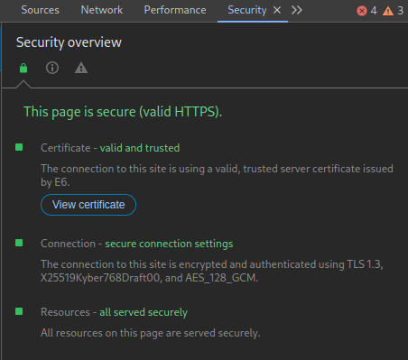

I really like [Nginx Proxy Manager](https://nginxproxymanager.com/) for its simplicity and included tools. However recently I thought about setting up some new shiny stuff with Post-Quantum key exchange algorithm called `X25519Kyber768Draft00`. It's already well supported in modern web servers and browsers. Google Chrome even decided to turn it on by default [(learn more)](https://pq.cloudflareresearch.com/).

## Building

Turns out `Kyber + X25519` key exchange isn't yet supported in OpenSSL so we need to somehow compile Nginx with BoringSSL (the fork that Chrome uses).
The lack of Brotli support in NPM also bothered me [(and not only me apparently)](https://github.com/NginxProxyManager/nginx-proxy-manager/issues/713) so I decided to compile my build with support for it. The file I modified the most was `docker-nginx-full/scripts/build-openresty` since it's responsible for configuring and building Nginx.
Since Nginx Proxy Manager is made out of two docker containers, we can modify their sources to build Nginx with custom parameters. I put relevant patches on my Github.

The commands needed to build Nginx Proxy Manager with my patches:

```shell
$ git clone https://github.com/olokelo/nginx-proxy-manager-bssl-brotli.git --recurse-submodules
$ cd nginx-proxy-manager-bssl-brotli/

$ cd docker-nginx-full/
$ git apply ../docker-nginx-full.patch
$ bash local-build.sh
...
Successfully built d2d440a978d7
Successfully tagged local-nginxproxymanager/nginx-full:certbot-node
❯ All done!

$ cd ../nginx-proxy-manager/
$ git apply ../nginx-proxy-manager.patch
$ bash scripts/ci/frontend-build  # build frontend first (important)
$ bash scripts/buildx
...
[Warning] One or more build-args [GOPRIVATE GOPROXY] were not consumed
Successfully built c835c103b923
Successfully tagged local-nginx-proxy-manager:latest
❯ Multiarch build Complete
```

Monitor the logs to ensure everything has been built properly.

## Important notes

I used `Docker version 27.1.1, build 63125853e3` however Docker is currently transitioning to `buildx` and it's possible some of my patches might not work in the future. I couldn't find a way to share the build context between two BuildKit instances (we need to build two containers) so I opted for the deprecated `docker build`.

My patch will only build image for `amd64` architecture. If you need to build for a different one, modify the line that says `--platform linux/amd64` in `nginx-proxy-manager/scripts/buildx` file.

Whenever you decide to upgrade Nginx Proxy Manager, you'll need to rebuild the containers with updated submodules.

## Modify overlay config files

Update Key Exchange policy in `ssl-ciphers.conf`
> This will limit clients to TLS 1.3 only however it shouldn't be too hard to also support older TLS 1.2
```
ssl_session_timeout 60m;
ssl_session_cache shared:SSL:10m;
ssl_ecdh_curve X25519Kyber768Draft00:X25519;

# intermediate configuration. tweak to your needs.
ssl_protocols TLSv1.3;
```

Load dynamic brotli modules in `root-top.conf`
```
load_module /usr/lib/nginx/modules/ngx_http_brotli_filter_module.so; # for compressing responses on-the-fly
load_module /usr/lib/nginx/modules/ngx_http_brotli_static_module.so; # for serving pre-compressed files
```

## Create and run docker-compose.yml

```bash
services:
  app:
    image: 'local-nginx-proxy-manager:latest'
    restart: unless-stopped
    ports:
      - '80:80'
      - '81:81'
      - '443:443'
    volumes:
      - ./data:/data
      - ./letsencrypt:/etc/letsencrypt
      - /etc/timezone:/etc/timezone:ro
      - ./ssl-ciphers.conf:/etc/nginx/conf.d/include/ssl-ciphers.conf
      - ./root_top.conf:/data/nginx/custom/root_top.conf
```

```shell
$ docker compose up -d
$ docker compose logs -f  # check if no apparent errors are displayed
```

## Verify it is working

If everything is set up correctly you should get the following output when logging into the container
```shell
$ docker exec -it containers-app-1 /bin/bash
 _   _       _            ____                      __  __                                   
| \ | | __ _(_)_ __ __  _|  _ \ _ __ _____  ___   _|  \/  | __ _ _ __   __ _  __ _  ___ _ __ 
|  \| |/ _` | | '_ \\ \/ / |_) | '__/ _ \ \/ / | | | |\/| |/ _` | '_ \ / _` |/ _` |/ _ \ '__|
| |\  | (_| | | | | |>  <|  __/| | | (_) >  <| |_| | |  | | (_| | | | | (_| | (_| |  __/ |   
|_| \_|\__, |_|_| |_/_/\_\_|   |_|  \___/_/\_\\__, |_|  |_|\__,_|_| |_|\__,_|\__, |\___|_|   
       |___/                                  |___/                          |___/           
Version dev (63d06da) 2024-08-02 21:00:03 CEST, OpenResty 1.25.3.2, debian 12 (bookworm), Certbot certbot 2.11.0
Base: debian:bookworm-slim, linux/amd64
Certbot: local-nginxproxymanager/nginx-full:latest, linux/amd64
Node: local-nginxproxymanager/nginx-full:certbot, linux/amd64
```
Your server should now support *State of the Art* Post-Quantum `X25519Kyber768Draft00` key exchange.




## Brotli

You can now use `brotli` directive when you log into Nginx Proxy Manager Web UI. Just to go your Proxy Host, Edit, Advanced and put

```
brotli on;
brotli_comp_level 6;
brotli_min_length 512;
brotli_types text/plain text/css application/json application/javascript application/x-javascript text/xml application/xml application/xml+rss text/javascript;
```

Enjoy :)
